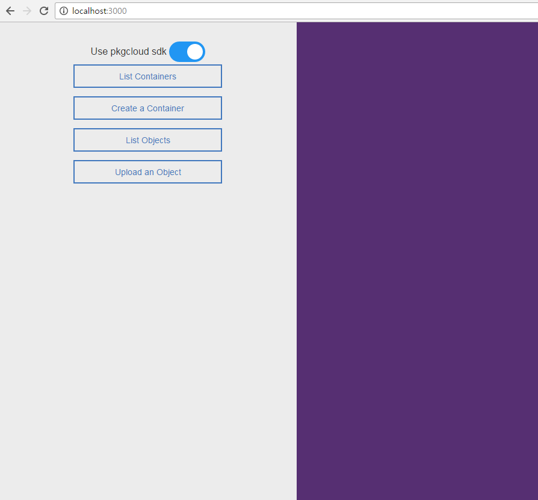

# Sample application for Bluemix Object Storage

This project includes sample source codes to utilize object storage in Bluemix.
You can learn how to list containers, create a container, list objects, and upload files.

## How to run this application

This app is a node.js based application.
Install required packages through this command.
<pre>npm install</pre>

And run application.
<pre>npm start</pre>

You can access the test UI through http://localhost:3000

## Which features are included

### Using pkgcloud library
- create container
- list containers
- list objects in a container
- upload a file to a container

### Not using pkgcloud library
- authenticate
- create container
- list containers
- list objects in a container
- upload a file to a container

## How to test

### Using pkgcloud library

Enable toggle button and click each button. The result will be shown in the right pane.

### Not using pkgcloud library

Disable toggle button and click each button. The result will be shown in the right pane.
